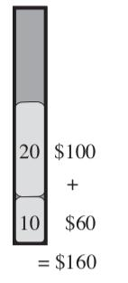
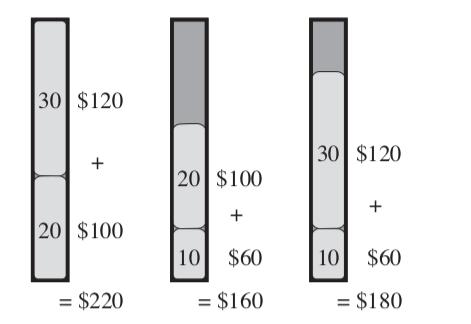

# 0-1 背包问题

## 要求

分别编程实现动态规划算法和贪心法求 0-1 背包问题的最优解，分析比较两种算法的时间复杂度并验证分析结果。

## 问题描述

0-1 背包问题: 给定 n 种物品和一背包。物品 i 的重量是 wi, 其价值为 vi,背包容量为 c。问应如何选择装入背包中的物品，使得装入背包中物品的总价值最大？

## 贪心算法

按单位重量价值排序，优先选择单位重量价值最多的

例如下面我们有三种物品，他们的重量和价格分别为 10，20，30kg 和 60，100，120

根据他们的单位重量价值排序为

因此根据其 v/m ,首先选的就是重量为 10 ，价值为 60 的物品。然后选择重量为 20，价值为 100 的物品。现在所用的重量就为 30，剩下 20，但是最后一个物品重量有 30 ，所以无法装入。

按照贪心算法，这应该得到的价值就是最大的。我们看一下所有的情况

显然按照贪心算法得到的并不是最优解，反而是价值最低的。

## 动态规划算法

动态规划算法的基本要素是「最优子结构性质」 和 「重叠子问题性质」，与分治法类似，也是将问题分解成若干个子问题，只不过适用于动态规划的子问题不相互独立。

假设编号分别为 a,b,c,d,e 的五件物品，重量分别是 2,2,6,5,4，价值分别是 6,3,5,4,6，现在有一个承重为 10 的背包，如何装入物品具有最大价值？

看下面这一张表

这个表是从左下开始的，慢慢的推到右上角。第一行的蓝色部分表示背包此时的可承重量，当承重量为 0 时，不可能放入物品，所以总价值一直为 0。(a,10)就表示，abcde 五种物品放入承重量为 10 的背包中的最大价值，也就是本问题的解。

我们可以从本问题的最终解出发 (a,10)，首先对于物品 a，有两种选择，放入或者不放入

放入：放入物品 a，那背包承重就为 10-2=8，还剩 bcde 四种物品，该情况下的最大价值为 (b,8) + 物品 a 的价值不放入： 背包承重不变，该情况下的最大价值为 (b,10)

(a,10) = max((b,8)+6,(b,10))

同理求 (b,8) 或者 (b,10)，最终可以递归得到结果

## 参考链接

https://blog.csdn.net/songshimvp1/article/details/52350542
