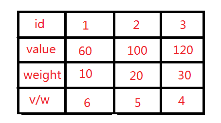

# 0-1 背包问题

## 要求

分别编程实现动态规划算法和贪心法求 0-1 背包问题的最优解，分析比较两种算法的时间复杂度并验证分析结果。

## 问题描述

0-1 背包问题: 给定 n 种物品和一背包。物品 i 的重量是 wi, 其价值为 vi,背包容量为 c。问应如何选择装入背包中的物品，使得装入背包中物品的总价值最大？

## 贪心算法

按单位重量价值排序，优先选择单位重量价值最多的

例如下面我们有三种物品，他们的重量和价格分别为 10，20，30kg 和 60，100，120

根据他们的单位重量价值排序为

因此根据其 v/m ,首先选的就是重量为 10 ，价值为 60 的物品。然后选择重量为 20，价值为 100 的物品。现在所用的重量就为 30，剩下 20，但是最后一个物品重量有 30 ，所以无法装入。

按照贪心算法，这应该得到的价值就是最大的。我们看一下所有的情况

显然按照贪心算法得到的并不是最优解，反而是价值最低的。

## 参考链接 

https://blog.csdn.net/songshimvp1/article/details/52350542