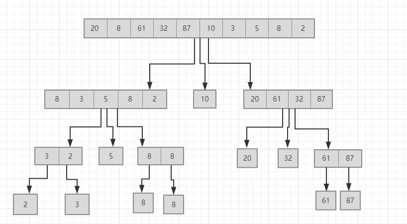
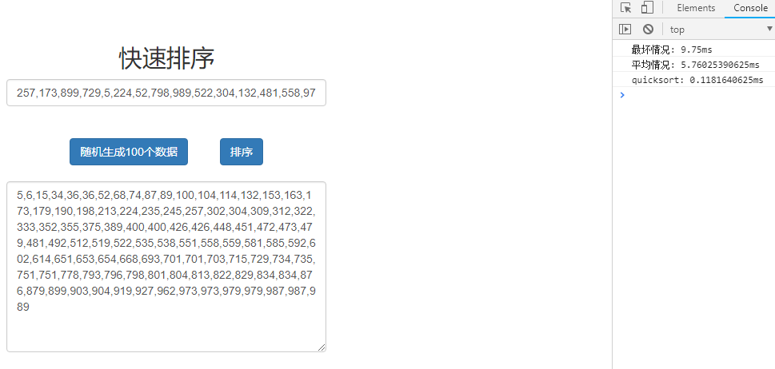

# 实验一  快速排序

## 一. 实验内容

运用分治递归思想，编程实现快速排序算法。通过不同实例测试，分析最坏、最好、平均情况下的时间复杂度，并设计实验程序验证分析结果。

## 二．实验目的

1.  理解递归的概念及实现方法
2.  掌握分治策略的基本思想以及用分治法解决问题的一般技巧
3.  掌握求解递归算法时间复杂度的一般方法。

## 三. 算法描述

### 方法一

**算法步骤**

1.  找到该数组的基准点「中间数」，并创建两个空数组 `left` 和 `right`
2.  遍历数组，将比基准点小的数值放到 `left` 数组中，将比基准点大的数值放到 `right` 数组中
3.  对数组 `left` 和 `right` 进行递归调用
4.  最后将数组 `concat`

**举例**

`20 8 61 32 87 10 3 5 8 2`



这种方法简单易懂，能深刻的理解到分治的思想。但是也存在很大的问题，因为在每次递归中都额外的生成了两个数组，会造成空间复杂度的飚升，因此并不推荐使用，在这里只作为更好的理解分治思想的算法，标准快排应该是利用 **原数组** 进行操作。

### 方法二

**算法步骤**

1.  声明一个 `storeIndex` 变量，初始化为数组的最左端的下标，声明一个 `base` 变量，为数组的最右端的数值
2.  遍历数组，找到小于 `base` 的数值，交换到 `storeIndex` 位置处，并对 `storeIndex` 加 1
3.  最后将基准元素 `base` 放到 `storeIndex` 位置处，左边是比其小的，右边是比其大的
4.  继续对左半部分和右半部分递归调用

## 四. 算法实现

### 数据结构

要进行排序的数组 `arr`

### 函数说明

**函数数值交换**

参数:

- arr: 需要将进交换的数组
- a : 交换的下标
- b : 交换的下标

```js
//交换
function swap(arr, a, b) {
  var temp = arr[a]
  arr[a] = arr[b]
  arr[b] = temp
}
```

**分区**

参数：

- arr : 需要交换的数组
- left : 数组最左端下标
- right : 数组最右端下标

返回

- storeIndex : 基准值

```js
//分区
function partition(arr, left, right) {
  // 刚开始没有基准，默认使用最右边元素
  var base = arr[right]
  /**
   * 存放小于 base 的元素时，是紧挨着上一元素的，否则空隙里存放的可能是大于 base 的元素，
   * 故声明一个 storeIndex 变量，并初始化为 left 来依次紧挨着存放小于 base 的元素。
   */
  var storeIndex = left
  for (var i = left; i < right; i++) {
    if (arr[i] < base) {
      /**
       * 遍历数组，找到小于的 base 的元素，
       * 将循环i次时得到的元素，通过 swap 交换放到storeIndex处，
       * 并对 storeIndex 递增 1，表示下一个可能要交换的位置
       */
      swap(arr, storeIndex, i)
      storeIndex++
    }
  }
  // 最后将基准元素放在 storeIndex 处，左边是比其小的，右边是比其大的
  swap(arr, right, storeIndex)
  return storeIndex
}
```

**排序**

参数：

- arr : 需要交换的数组
- left : 数组最左端下标
- right : 数组最右端下标

```js
function sort(arr, left, right) {
  if (left > right) return
  //获取基准值
  var storeIndex = partition(arr, left, right)
  //对左半部分进行排序
  sort(arr, left, storeIndex - 1)
  //对右半部分进行排序
  sort(arr, storeIndex + 1, right)
}
```

### 2.源程序代码

```js
/**
 *
 * @param {要排序的数组} arr
 */
function quicksort(arr) {
  //交换
  function swap(arr, a, b) {
    var temp = arr[a]
    arr[a] = arr[b]
    arr[b] = temp
  }

  //分区
  function partition(arr, left, right) {
    // 刚开始没有基准，默认使用最右边元素
    var base = arr[right]
    /**
     * 存放小于 base 的元素时，是紧挨着上一元素的，否则空隙里存放的可能是大于 base 的元素，
     * 故声明一个 storeIndex 变量，并初始化为 left 来依次紧挨着存放小于 base 的元素。
     */
    var storeIndex = left
    for (var i = left; i < right; i++) {
      if (arr[i] < base) {
        /**
         * 遍历数组，找到小于的 base 的元素，
         * 将循环i次时得到的元素，通过 swap 交换放到storeIndex处，
         * 并对 storeIndex 递增 1，表示下一个可能要交换的位置
         */
        swap(arr, storeIndex, i)
        storeIndex++
      }
    }
    // 最后将基准元素放在 storeIndex 处，左边是比其小的，右边是比其大的
    swap(arr, right, storeIndex)
    return storeIndex
  }

  function sort(arr, left, right) {
    if (left > right) return
    //获取基准值
    var storeIndex = partition(arr, left, right)
    //对左半部分进行排序
    sort(arr, left, storeIndex - 1)
    //对右半部分进行排序
    sort(arr, storeIndex + 1, right)
  }

  sort(arr, 0, arr.length - 1)
  return arr
}
```

## 五．程序运行结果




## 六．实验结果分析

每次点击排序都会将上面输入框的数据进行排序，并在右面显示出运行的时间

```js
var arr1 = [] //最坏情况
var arr2 = [] //随机数组

for (var i = 0; i < 1000; i++) {
  arr1[i] = i
  arr2[i] = Math.random() * 10000
}
```

实验结果可以看出两者相差的时间还是挺大的，最好的情况就是比较基准值后分开的数组左右相等，时间复杂度为 O(nlogn)，最差的情况就是每次分组都严重失衡，一侧只有一个，剩下的都在另一次，那这种情况下的复杂度就为 O(n²)

## 七．结论

快速排序使用的分治方法能将一个规模较大的问题分割成规模较小的相同问题，基准值的选取在其中起到了至关重要的作用，对于顺序问题来说，基准值可以区中间值，对于随机问题来说，基准值也可以取随机值。因此对于基准值的处理才是优化快速排序的关键。